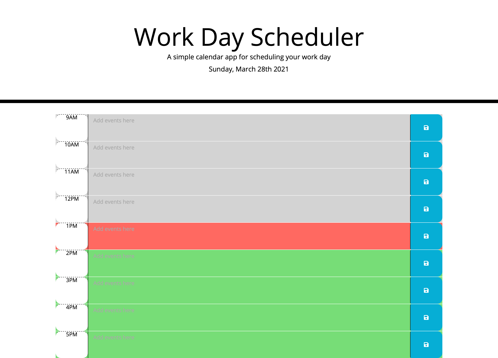
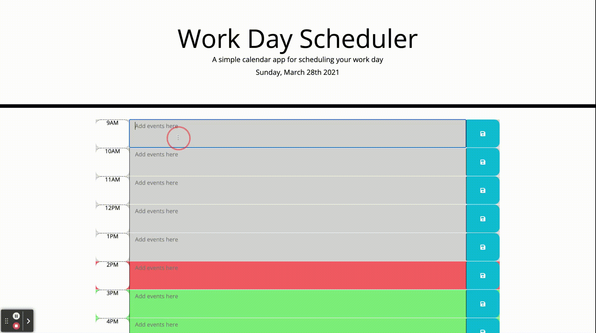

# work-day-scheduler
A simple calendar application

## Description
This is a simple calendar application that enables the user to save events for each hour of the day. This web application is run on the browser and features the dynamically updated HTML and CSS which is powered by jQuery.
The Javascript code provides a clean, polished and responsive user interface that adopts to multiple screen sizes.

## User Guide
This section provides detailed description on how to use the Work Day Calendar Scheduler:

The user enters events accoording to the time  required into the daily planner and clicks the save button under each time period. The event is saved successfully so that any given period when the user re-opens or refreshes the daily planner, they can see the timeblocks as well as the respective events allocated to those times.  

Also, when the user opens the woork scheduler, the current day/date is displayed at the top of the calendar.

## Links to deployed application
* URL of deployed application: https://e-giftz.github.io/work-day-scheduler/

* URL of GitHub repository containing the code: https://github.com/e-giftz/work-day-scheduler

## Screenshots of Web App

## Work Scheduler App Demo

